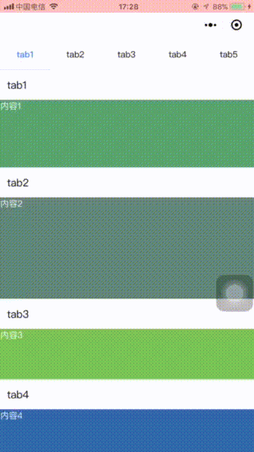

# 微信小程序的滚动组件
## 使用方法
	
- 将 components 文件夹复制到项目根目录。（与pages同级） 
- 在需要引用的 wxml 文件中：

```
<mylist catalogBig="{{catalogBig}}" content="{{content}}">
  <view slot="content_0" class="content_1">内容1</view>
  <view slot="content_1" class="content_2">内容2</view>
  <view slot="content_2" class="content_3">内容3</view>
  <view slot="content_3" class="content_4">内容4</view>
  <view slot="content_4" class="content_5">内容5</view>
</mylist>
```
- 在js中：

```
data: {
  catalogBig: [], // 目录
  content: [] // 内容遍历数组，不需要赋值
},
onLoad: function (options) {
  // 主页面传参给组件
  let optionBig = ['tab1', 'tab2', 'tab3', 'tab4', 'tab5']
  this.setData({
    catalogBig: optionBig
  })
}
```

- 在 json 中声明组件

```
{
  "usingComponents": {
    "mylist": "/components/dsScrollCatalog/dsScrollCatalog"
  }
}
```

   


